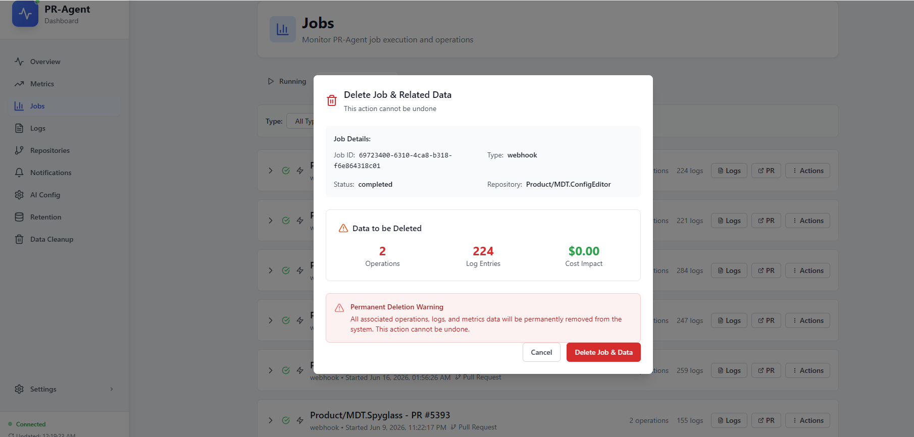
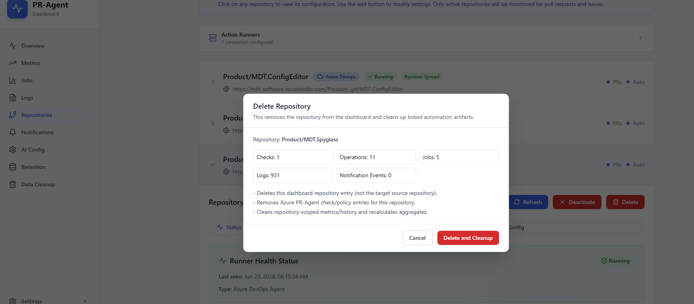
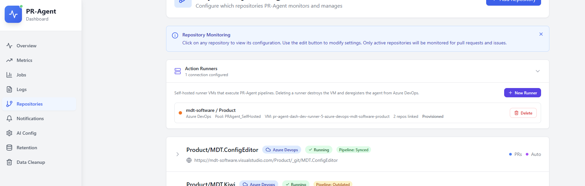
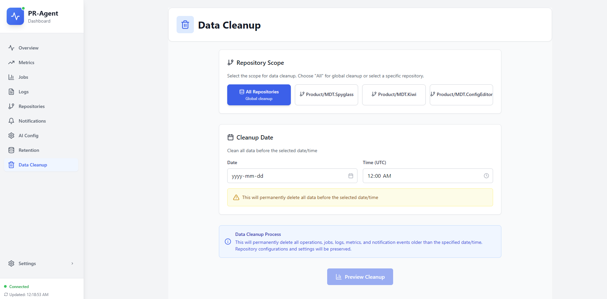

# Cleanup and retention

Deleting PR-Agent jobs, removing repositories (with Azure DevOps cleanup), bulk admin cleanup, and runner deprovisioning.

## What gets stored

- **Jobs, operations, logs**: PostgreSQL (prod) or SQLite (dev). Deleting a job removes related operations and logs; aggregate metrics are recalculated (the delete preview may not show per-row metrics).
- **Repositories**: Dashboard records with encrypted PATs; Azure DevOps policies, pipelines, and YAML are separate.
- **Runner connections**: Dashboard records plus GCE VM references; deleting a connection unlinks repos but does not delete them.

Azure DevOps artifacts require explicit cleanup; behavior differs by delete path (see below).

## Delete a single job

1. Open **Jobs**
2. On the job row, open the menu → **Delete Job & Related Data**
3. Review the preview (operations, logs, cost impact)
4. Confirm delete

This does **not** remove Azure DevOps PR comments or pipeline history.

## Remove a repository: two paths

### Path A: Preview / async cleanup (recommended)

1. Open the repository card
2. Click **Delete**
3. Review the cleanup preview in the modal
4. Start cleanup and wait for completion

Cleanup typically:

1. Removes Azure **build validation policies** (PR-Agent checks)
2. Deletes dashboard metrics and history for the repo
3. Removes the repository record from the dashboard

Does **not** remove pipeline definitions or YAML files in git unless you use Azure-only cleanup options below.

### Path B: Direct delete

Use when you also want pipeline definitions removed from Azure DevOps (in addition to policies and the dashboard record).

| Action | Policies | Pipelines | YAML in git | Dashboard record |
|--------|----------|-----------|-------------|------------------|
| Cleanup modal (preview/start) | Yes | No | No | Yes |
| Direct delete | Yes | Yes | No | Yes |
| Azure-only cleanup | Optional | Optional | Optional | No |

### Azure-only cleanup (keep dashboard entry)

From the repository card, run **Azure cleanup** when you want to remove ADO resources but keep the repo registered in the dashboard. Choose whether to remove policies, pipelines, and YAML in git.

### PAT invalid during delete

The dashboard can remove the database record with **best-effort** Azure cleanup. Orphaned policies may remain; remove them manually in Azure DevOps if the PAT expired.

## Delete runner connection

1. Open **Repositories**
2. Expand **Action Runners**
3. Delete the connection

If the VM was provisioned from the dashboard, deprovision destroys the GCE instance. Repositories are **unlinked**, not deleted. Confirm the agent is removed from the Azure DevOps pool after delete.

## Bulk admin cleanup

Two items in the admin navigation:

- **Retention**: configure how long to keep jobs and related data
- **Data Cleanup**: preview and execute bulk delete by date or repository

Use **Data Cleanup** to preview impact before executing a bulk delete.

## Scheduled cleanup

Production deployments automatically fail jobs that stay **running** too long (about one hour). Scheduled bulk retention on the database may be disabled on managed SQL; use **Retention** and **Data Cleanup** in the admin UI for production housekeeping.

## What is never deleted automatically

- PR comments in Azure DevOps (historical reviews)
- Shared `pr-agent-pipelines` repo (used across repos)
- GCS global config (independent of job/repo cleanup)
- Git commits (YAML, config PRs) unless Azure cleanup explicitly removes YAML

Automation and cron details: [Dashboard API: Admin and cron](../technical/dashboard-api/admin-and-cron.md).
