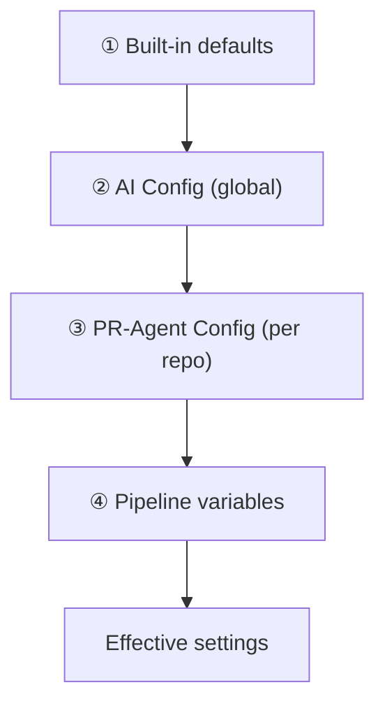
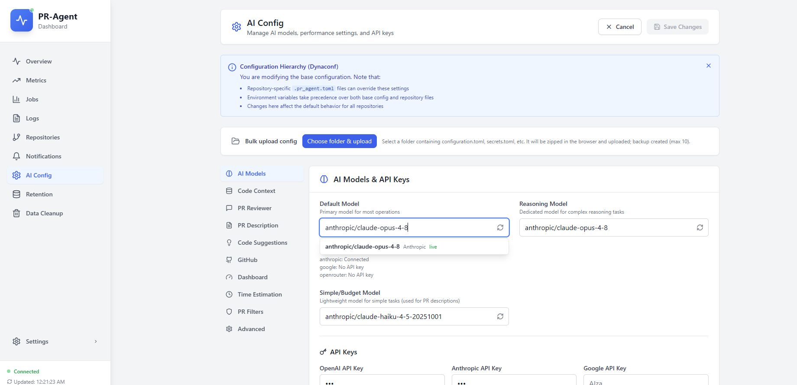
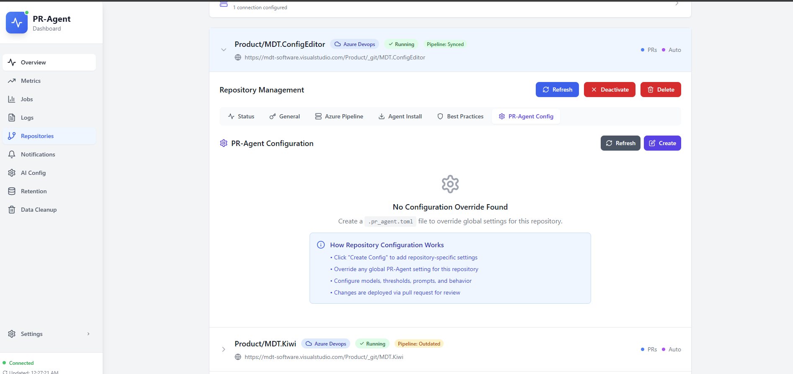
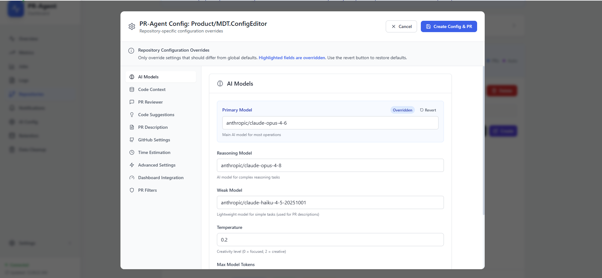
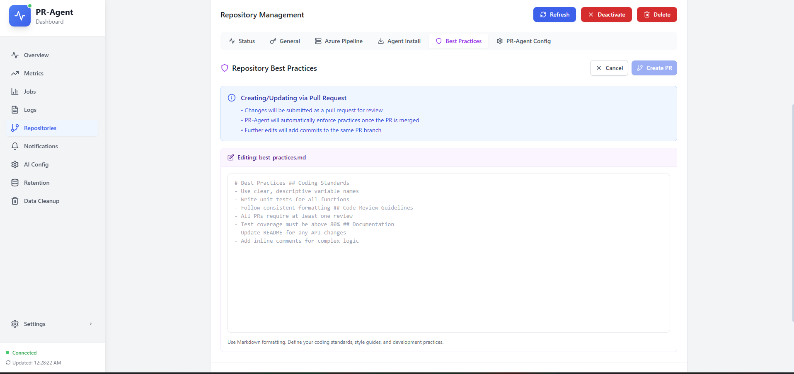

# Configuration and overrides

Global settings in **AI Config**, per-repository overrides in **PR-Agent Config**, and coding standards in **Best Practices**: how they interact for Azure DevOps deployments.

## Configuration hierarchy

Later layers override earlier ones.

| Layer | Where you edit | What it covers |
|-------|----------------|----------------|
| ① Built-in | (not editable) | Factory defaults and prompts |
| ② Global | **AI Config** | Models, keys, filters, tool defaults for all repos |
| ③ Per repo | **PR-Agent Config** | Overrides for one repository (opens a PR when needed) |
| ④ Pipeline | **Azure Pipeline** tab | PAT, keys, dashboard URL, synced by **Fix Issues** |

**Best Practices** is separate: markdown loaded into review and improve prompts, not a numeric config layer. See [Best practices](#best-practices) below.

Storage and merge rules for engineers: [TOML configuration system](../technical/toml-configuration-system.md).

## Global configuration: AI Config

**Nav:** Dashboard → **AI Config** → **Edit** → **Save**

### Tab structure (UI labels)

- **AI Models**: Default, Reasoning, and Simple/Budget models; temperature; reasoning effort; **API keys**
- **Code Context**: C# context service
- **PR Reviewer / Description / Code Suggestions**: tool defaults
- **GitHub**: legacy; ignore for Azure DevOps-only deployments
- **Dashboard**: dashboard URL, API key
- **Time Estimation**: dev time estimation
- **PR Filters**: skip/terminate conditions; see [Configuring PR filters](configuring-pr-filters.md)
- **Advanced**: fallback models, **Repository Settings Files**, verbosity, timeouts, config path display

There is **no separate "API Keys" tab**: keys live under **AI Models**.

### Advanced → Repository Settings Files

- **Repo Settings Branch**: force which branch PR-Agent Config and Best Practices load from. **Empty = auto:** PR source → target → repo default → main/master/develop
- **Use repository settings file**: turn per-repo overrides on or off globally

### Options not in the UI

Saving merges your edits with existing global config: values not shown in the UI are preserved. For rarely used keys, use **Bulk upload** on **AI Config** (see [technical config doc](../technical/toml-configuration-system.md)).

## API keys and models

See [Choosing and configuring AI models](choosing-and-configuring-ai-models.md).

Summary:

1. **AI Models** → enter keys → **Save**
2. **Test Model**
3. Repository **Azure Pipeline** → **Fix Issues**

## Per-repository: PR-Agent Config

**Nav:** Repository card → **PR-Agent Config** → **Edit** or **Create**

Changes on protected branches go through an Azure DevOps **pull request**. The pending PR banner shows merge status.

Editor sections match **AI Config**: Models, Code Context, PR Reviewer, Code Suggestions, PR Description, Time Estimation, **Advanced**, Dashboard Integration, **PR Filters**. Only fields you change are saved as overrides (highlighted in blue when they differ from global).

Example workflow:

1. Open **PR Reviewer** → set **Max Findings** and **Extra Instructions**
2. Open **Models** → pick a **Primary Model** override
3. Open **PR Filters** → lower **Max lines changed**
4. **Save** → merge the config PR

### Which tools run on each PR (describe / review / improve)

The wizard **Auto Review / Describe / Improve** checkboxes are dashboard flags only; they do **not** control pipeline behavior.

To control tools at runtime:

1. Open **Azure Pipeline** → **Edit pipeline config**
2. Use **Show Environment Variables** for the `AZURE_DEVOPS_CONFIG.AUTO_*` names, or edit the YAML step directly
3. Run **Fix Issues** after changing global keys or defaults

There is no dedicated toggle for this in **PR-Agent Config** today. File-based overrides for advanced cases: [TOML configuration system](../technical/toml-configuration-system.md).

## Effective config

Open **View Effective Config** on the repository card.

Shows override-focused summary with priority (global → repo → pipeline). Opening it triggers a fresh repository config check.

## Best practices

**Nav:** Repository card → **Best Practices** tab

Edit markdown coding standards → **Save** opens a PR when the branch is protected. Used by **Review** and **Improve**, not at pipeline startup. Branch resolution follows the same rules as **PR-Agent Config** (**AI Config → Advanced → Repo Settings Branch**).

## Azure pipeline config (separate concern)

Controls **how** PR-Agent runs (YAML, variables, policies), not model or review behavior.

**Azure Pipeline** tab: edit pipeline YAML, view environment variables, run **Fix Issues**, read the installation guide.

## Quick reference

- **Default model for all repos**: AI Config → AI Models
- **One repo model override**: PR-Agent Config → Models
- **PR filters (global / repo)**: [Configuring PR filters](configuring-pr-filters.md)
- **Force config branch**: AI Config → Advanced → Repo Settings Branch (empty = auto)
- **Disable improve on one repo**: Azure Pipeline env vars or YAML (see above)
- **Push keys to ADO**: Azure Pipeline → **Fix Issues**
- **Coding standards**: Best Practices tab
- **See merged effective settings**: View Effective Config
