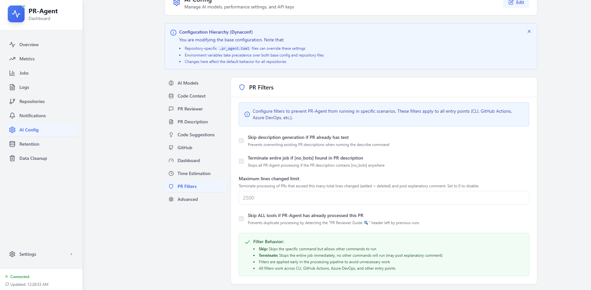

# Configuring PR filters

PR filters control **when PR-Agent skips or stops** for a given pull request. They are separate from file-ignore patterns and from webhook-only title/label ignore rules (GitHub/GitLab only; **not used on Azure DevOps**).

## The four filter settings

All four appear on **AI Config → PR Filters** and **PR-Agent Config → PR Filters**. If none are configured, **no filters run**.

| UI control | Default | Effect |
|------------|---------|--------|
| **Skip if description exists** | on | **Skip describe only** when the PR already has a non-empty description |
| **Terminate on [no_bots]** | on | **Stop the entire job** when the PR description contains `[nobots]` or `[no_bots]` |
| **Max lines changed** | 1000 (`0` = disabled) | **Stop the entire job** when added + deleted lines exceed the limit; posts an explanatory PR comment |
| **Skip ALL tools if PR-Agent has processed PR** | off | **Skip the current command** when prior PR-Agent output is detected (e.g. "PR Reviewer Guide") |

### Skip vs terminate

- **Skip**: drops one command (describe, review, or improve). Other enabled tools may still run.
- **Terminate**: ends processing for that pipeline run. No further tools execute.

## Where to configure filters

### Global defaults (all repositories)

1. Dashboard → **AI Config** → **PR Filters** tab.
2. Adjust toggles and **Max lines changed**.
3. **Save**.
4. Filters apply on the **next pipeline run** (new PR-Agent process).

### Per-repository overrides

1. **Repositories** → select repo → **PR-Agent Config**.
2. Open the **PR Filters** section.
3. Change only fields that should differ from global. Changed fields are highlighted; unchanged fields inherit global values.
4. **Save** → merge the config PR when prompted.
5. Overrides apply once the merged config is loaded on the next run.

See [Configuration and overrides](configuration-and-overrides.md) for the full hierarchy.

## Common recipes

### Skip re-describing PRs that already have text

Leave **Skip if description exists** on (global or per repo).

Developers who write their own descriptions keep them; describe runs only when the body is empty.

### Let developers opt out

Leave **Terminate on [no_bots]** on.

Developers add `[no_bots]` or `[nobots]` in the PR description to skip the run. [Using AI code reviews](../overview/using-ai-code-reviews.md).

### Cap cost on huge diffs

Set **Max lines changed** to `800` (or your limit) in **AI Config** or **PR-Agent Config**.

When exceeded, PR-Agent posts a comment with the line count and stops. Set `0` to disable.

### Avoid duplicate review comments on re-runs

Turn on **Skip ALL tools if PR-Agent has processed PR**.

Useful when pipelines re-trigger on every push and you do not want a second review block if one already exists.

### Stricter filters for one repo only

Keep global defaults in **AI Config**; override only **Max lines changed** or **Skip if description exists** in **PR-Agent Config** for that repo.

## Troubleshooting

| Symptom | Likely cause | Fix |
|---------|--------------|-----|
| Job status **skipped**, operations skipped | All commands filtered | Check Jobs → operation logs; review filter settings |
| Run stops immediately, no tools | `[no_bots]` or max lines matched | Read PR description and diff size |
| Filters seem ignored | Filters never saved | **Save** from **AI Config → PR Filters** |
| Repo override not applied | Config PR not merged | Confirm PR merged; check **View Effective Config** |
| Expected webhook-style ignore | Title/label ignore on Azure | Those rules apply to GitHub/GitLab webhooks only; use PR Filters on ADO |

For skipped-job diagnostics: [Maintenance and diagnostics](maintenance/README.md).

Filter implementation details: [TOML configuration system](../technical/toml-configuration-system.md).
