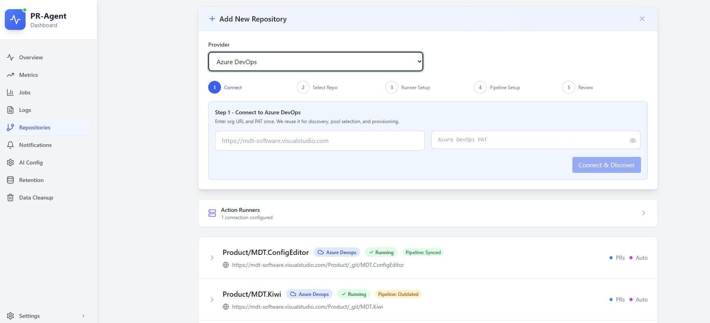

# Onboarding wizard steps

Dashboard → **Repositories** → **Add Repository** → **Azure DevOps**.

## Step 1: Connect

1. Enter organization URL: `https://dev.azure.com/{org}` or `https://{org}.visualstudio.com`
2. Paste your PAT
3. Click **Connect & Discover**

The wizard lists projects and repositories. When available, a **PAT identity** panel shows which Azure DevOps user will post review comments (matches the PAT owner).

## Step 2: Select Repository

1. Use the searchable **Project / Repository** dropdown
2. Confirm name and URL
3. Click **Next: Runner Setup**

## Step 3: Runner Setup

Choose the **agent pool** name your pipeline YAML will use.

### Provision a GCE runner (GCP)

1. Click **Provision Runner VM** (creates an Action Runner Connection if needed)
2. Do **not close or refresh** the browser during provisioning
3. Wait until milestones show the VM online and the agent registered in Azure DevOps

Requires backend GCP settings on the dashboard deployment. If bootstrap fails, the VM may remove itself after about 15 minutes. See [Self-hosted runners](../../technical/self-hosted-runners.md).

### Use an existing agent

If an agent is already **online** in your pool, choose **Skip for now** or **Continue**.

## Step 4: Pipeline Setup

- **Branch to protect**: target branch for build validation
- **Policy mode**: optional or required
- Click **Set Up Pipeline & Check** when ready (setup does not run automatically on entering the step)

Setup typically:

1. Adds or updates YAML in the shared **`pr-agent-pipelines`** repo (default) or the target repo
2. Creates the pipeline in Azure DevOps
3. Adds build validation on **Branch to protect**
4. Shows a result checklist in the wizard

### After setup (required)

The wizard does **not** sync pipeline variables. Before the first successful AI run:

1. **Merge** the setup PR in the shared pipeline repo if the UI shows that banner
2. Open the repository card → **Azure Pipeline** tab → **Fix Issues** (syncs keys, dashboard URL, PAT, and image)
3. Confirm the agent is **online** in the Azure DevOps agent pool

You can **Skip** pipeline setup in the wizard and configure later from the repository card.

## Step 5: Review & Save

Three checkboxes update dashboard flags only (not pipeline behavior):

- **Active**: include repo in dashboard monitoring
- **Monitor Issues**: track configuration issues for this repo
- **Auto Review / Describe / Improve**: dashboard flags only

Click **Add Repository**. The dashboard runs health and config checks.

To control which tools run on each PR, use **Azure Pipeline** → **Show Environment Variables** or edit the pipeline YAML. See [Configuration and overrides](../configuration-and-overrides.md#which-tools-run-on-each-pr-describe--review--improve).

### After save: Azure Pipeline tab

Open the repository card → **Azure Pipeline**. The **Setup Readiness Checklist** shows YAML, variables, and policy status. Run **Fix Issues** to sync variables and repair build validation.
