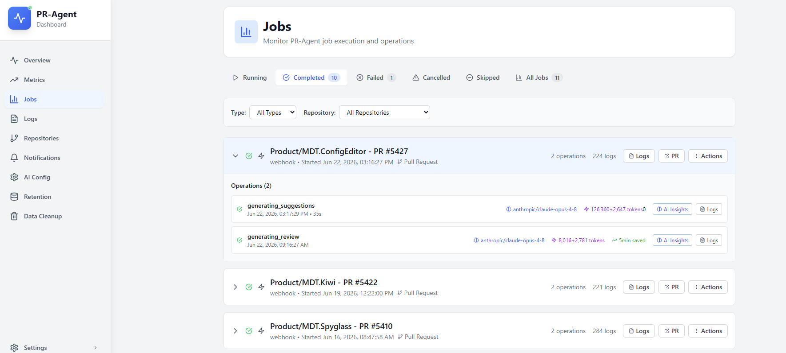
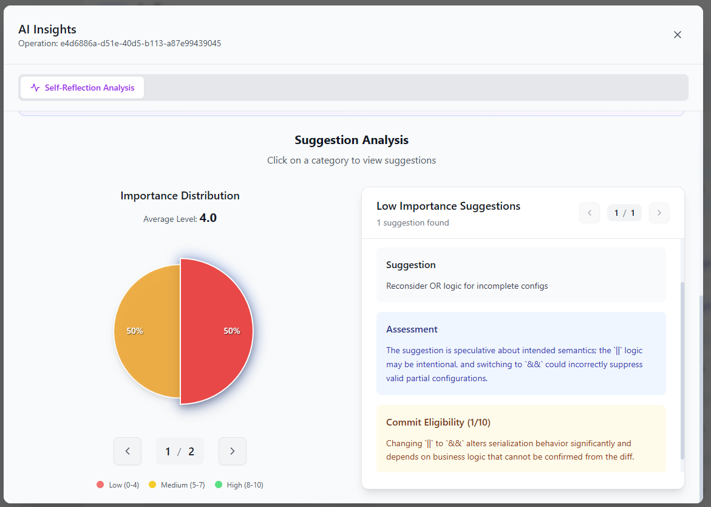
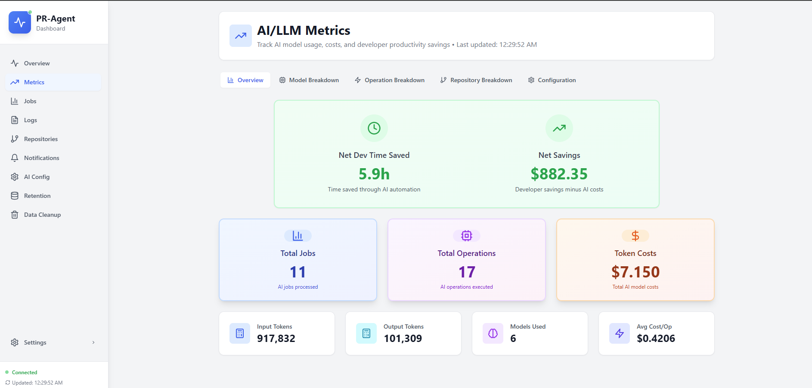

# Reading metrics and ROI

The **Metrics** tab shows developer hours saved, AI spend, net savings, and ROI.

For REST or export details, see [Dashboard API: Metrics](../technical/dashboard-api/metrics.md).

## What gets measured

Each describe, review, and improve run can include **developer time estimation**:

1. Primary tool completes (review, description, or suggestions).
2. A second pass estimates hours saved by category.
3. Results attach to the operation.
4. Dashboard aggregates across repos and date ranges.

Per-operation detail: **Jobs** → job → operation → **Operation Insights**.

## Configuration

**Metrics → Configuration**:

| Setting | Purpose |
|---------|---------|
| **Developer hourly rate** | Dollar value per estimated hour saved |
| **Hours multiplier** | Scales AI estimates (e.g. `0.5` conservative, `1.0` optimistic) |
| **Per-model token pricing** | Input/output cost per model |

Adjust rates and negotiated model pricing to match your organization.

## Dashboard views

- **Total developer time saved**: sum of estimated hours (after multiplier)
- **AI cost**: token usage × configured model rates
- **Net savings**: (hours × hourly rate × multiplier) − AI cost
- **ROI**: net savings relative to AI spend

Filter by repository to compare pilots vs wider rollout.

## Interpreting ROI

Time-saved numbers come from a second LLM pass per tool, not manual surveys. Net savings use **actual token cost** from the dashboard. Use a conservative multiplier when you need cautious figures and document assumptions.

Limitations:

- Estimates are LLM approximations, capped per operation (typically ±16h before persistence).
- Skipped or filtered PRs contribute no hours.
- ROI improves when filters exclude huge diffs and opt-out PRs appropriately.

[What is this project?](../overview/what-is-this-project.md#metrics-and-roi). [Developer time estimation](../technical/internals/code-context-and-estimation.md#developer-time-estimation).

## Cost levers

| Lever | Effect |
|-------|--------|
| Disable **improve** on low-value repos | Fewer tokens per PR |
| [PR filters](configuring-pr-filters.md): `max_lines_changed` | Skip large diffs |
| Cheaper primary model in [AI Config](choosing-and-configuring-ai-models.md) | Lower per-PR cost |
| Reasoning model only where needed | Sonnet primary + Opus reasoning selectively |
