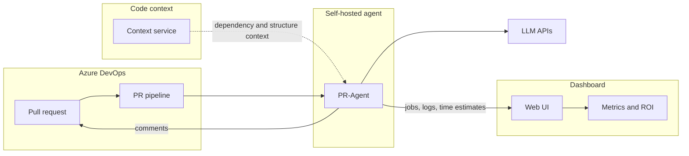

# What is this project?

**AI Code Reviews - PR-Agent** runs automated pull-request assistance on **Azure DevOps**. A **dashboard** onboards repos, shows run history, holds shared config, and reports ROI.

PR-Agent reads each PR diff (plus optional repository context), calls your LLM providers, and posts back to Azure DevOps: a **review**, an updated **description**, and optional **code suggestions**. This deployment adds:

- **Code context service**: repository analysis beyond the diff (dependencies, call chains, related code).
- **Time estimation and ROI**: a second LLM pass estimates developer hours saved; the dashboard rolls that up against model cost.

Admins use the dashboard for Azure DevOps setup, GCP runners, and config. Developers work in Azure DevOps only. See [Using AI code reviews](using-ai-code-reviews.md).

## What it's for

PR-Agent targets **deep review**: security, complex logic, concurrency (async/threading, races, deadlocks), architecture and dependencies (stronger with **code context**), meaningful test gaps, and team standards in optional `best_practices.md`.

It is **not** a linter or formatter. Indentation, import order, and style belong in lint/format CI (ESLint, StyleCop, Prettier, etc.).

## Why teams use it

Security- and logic-heavy changes are slow to review by hand. PR-Agent runs a substantive pass on every PR so senior engineers spend time on design and risk, not rediscovering issues linters miss.

| Benefit | How it shows up |
|---------|-----------------|
| **Faster review cycles** | Deep findings before human review; describe fills weak PR descriptions |
| **Consistent quality bar** | Security, concurrency, and team standards on every PR |
| **Senior time reclaimed** | Complex and security issues flagged early |
| **Measurable ROI** | Dashboard Metrics: estimated hours saved minus model cost |

The dashboard shows whether runs are healthy, why a PR failed, what models cost, and whether the investment pays off.

## Components

- **PR-Agent**: self-hosted Azure DevOps agent, PR pipeline, describe / review / improve.
- **Code context service** (optional): structure and dependencies for supported codebases (C# today).
- **Dashboard**: repo wizard, jobs/logs, AI and context config, metrics.

## Pull request flow

1. Developer opens or updates a PR.
2. **Build validation** on the target branch queues the PR-Agent pipeline.
3. A **self-hosted agent** (usually a dashboard-provisioned GCE VM) runs PR-Agent in Docker.
4. PR-Agent loads config, applies repo settings, optionally calls **code context**.
5. Enabled tools run; comments post to the PR; telemetry goes to the dashboard.
6. Each tool can record **developer time saved** for ROI.

## Code context service

The diff alone is often insufficient. The **code context service** returns compact repository context merged into review/improve prompts.

- Configure in **AI Config → Code Context** (global) or per repo.
- Health: **Overview → Context Service**.
- Runs when enabled and the PR includes supported files (C# is the primary path).

Connection testing: [Maintenance troubleshooting](../how-to/maintenance/troubleshooting.md).

## Metrics and ROI

Describe, review, and improve can each run a **time-estimation** step. Results appear under **Jobs → operation insights**. The **Metrics** tab aggregates hours saved, AI spend, net savings, and ROI.

[Reading metrics and ROI](../how-to/reading-metrics-and-roi.md). API: [Dashboard API: Metrics](../technical/dashboard-api/metrics.md).

## Tools on each PR

All three are optional per repo:

- **Describe**: PR title and description
- **Review**: security, logic, concurrency, tests, best practices (not formatting)
- **Improve**: substantive code suggestions

Toggle via `.pr_agent.toml`, pipeline variables, or global config: [Configuration and overrides](../how-to/configuration-and-overrides.md). Skip rules: [Configuring PR filters](../how-to/configuring-pr-filters.md).

## Dashboard tabs

- **Overview**: database, config, context service, repo health
- **Jobs / Logs**: live and historical runs
- **Repositories**: wizard, pipeline readiness, runners
- **AI Config**: models, keys, code context, global TOML
- **Metrics**: time saved, AI cost, ROI

## Default GCP layout

- **Dashboard**: Cloud Run; config in GCS; jobs in Cloud SQL
- **PR-Agent**: Docker on a GCE runner VM
- **Code context service**: separate deployment (AI Config)

[Deployment on Google Cloud](../technical/deployment/README.md).

## Next steps

- [Using AI code reviews](using-ai-code-reviews.md) (developers)
- [Adding your first repo](../how-to/onboarding/README.md) (admins)
- [Azure PR architecture](../technical/azure-architecture/README.md) (engineering)
