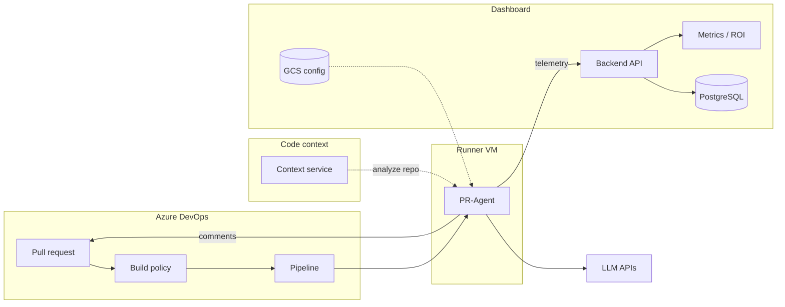
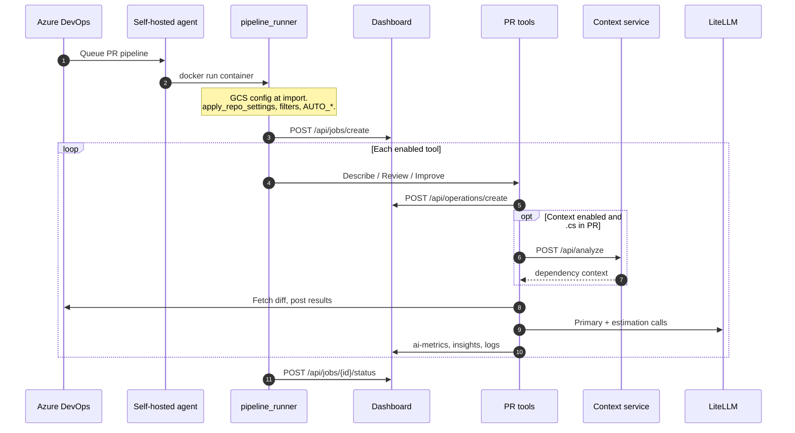
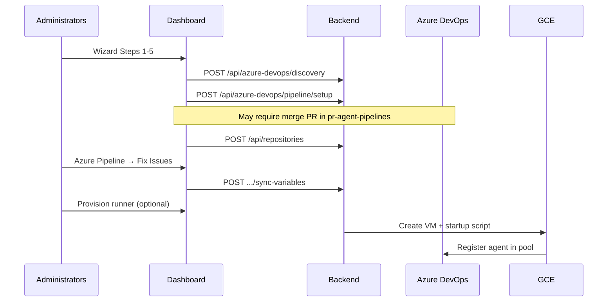

# Azure PR architecture

What happens from an Azure DevOps pull request through AI review to dashboard telemetry. On the default path, a build validation policy queues a job on a self-hosted agent running `azuredevops_pipeline_runner` in Docker.

## System architecture



## Correct execution sequence



Key details:

- GCS config loads at **`config_loader` import**, not as an explicit runner step
- **`apply_repo_settings`** runs **before** job create
- **Operations** are created inside each tool via `operation_context`
- Tools are invoked directly by the pipeline runner via `operation_context`
- **`best_practices.md`** loads inside review/improve tools only
- **Code context** is fetched inside tools via `get_pr_context()` when enabled and the PR includes `.cs` files
- **Dev-time estimation** is a second LLM call per tool; results feed dashboard **Metrics / ROI**

## Code context in the PR flow

When enabled, PR-Agent calls an external **code context service** before building review/improve prompts. The service clones or reads the repo (using the ADO PAT), analyzes structure and dependencies, and returns compact context merged into the AI prompt, not just the raw diff.

| Step | Component | Detail |
|------|-----------|--------|
| Gate | `get_pr_context()` in `pr_agent/algo/pr_processing.py` | Skipped when disabled or no `.cs` files in the PR |
| Client | `pr_agent/algo/csharp_context_client.py` | Login + `POST {url}/api/analyze` |
| Config | `[csharp_code_context_service]` | Split across `csharp_code_context.config.toml` and `csharp_code_context.secrets.toml` in GCS |
| Health | Dashboard `GET /api/health/context` | Overview **Context Service** card |

The context service runs **outside** the runner VM. PR-Agent only needs network reachability and credentials configured in AI Config.

See [Code context and time estimation](../internals/code-context-and-estimation.md).

## Onboarding sequence (dashboard)



See [Adding an Azure DevOps repository](../../how-to/onboarding/README.md).

## Trigger: build validation policy

Build validation can be **optional** (pipeline runs but may not block merge) or **required** (merge blocked until the pipeline completes). Either way, the pipeline must see `BUILD_REASON=PullRequest`.

Comment-triggered runs are **not** supported on Azure DevOps cloud pipelines.

## Cross-repo build validation

Shared pipeline YAML often lives in a different repo than the PR being reviewed. The runner builds `pr_url` from `SYSTEM_PULLREQUEST_SOURCEREPOSITORYURI` (the actual PR repo), not from `BUILD_REPOSITORY_NAME` (which points at the pipeline repo, typically `pr-agent-pipelines`). `SYSTEM_TEAMPROJECT` is a fallback when project names differ.

The runner logs cross-repo builds explicitly when pipeline repo ≠ PR repo.

## Skip and early-exit conditions

**No dashboard job created**

- Missing `BUILD_REASON`, PR ID, project/repo, collection URI, or PAT → stdout message, silent return
- `BUILD_REASON` ≠ `PullRequest` → skip message
- PR description contains the dashboard auto-PR marker → skip entire run
- `check_pr_filters` → `should_terminate` → error log, return
- All `AUTO_*` explicitly `false` → "No tools enabled"

**Dashboard job created**

- All commands filtered → `should_skip` → job status `skipped`, operations `skipped`
- Tool partial failure → job `completed` if **any** tool succeeded; `failed` if **all** failed

### Auto flag defaults

```python
# None or unset → ENABLED
if auto_describe is None or is_true(auto_describe):
    commands_to_run.append("describe")
```

Resolution order: `AZURE_DEVOPS_CONFIG.*` → `AZURE_DEVOPS.*` → repo TOML → global config.

See [Configuring PR filters](../../how-to/configuring-pr-filters.md).

## Docker pipeline step (GCP default)

Generated YAML from `dashboard/backend/services/azure_pipeline_config_service.py`:

1. `source /opt/pr-agent-runner/env`
2. Resolve `IMAGE` from pipeline var or `GCP_RUNNER_PR_AGENT_IMAGE`
3. `docker login` to Artifact Registry (metadata token)
4. `docker pull $IMAGE`
5. `docker run --rm --network=host --entrypoint python3 ... -m pr_agent.servers.azuredevops_pipeline_runner`

The container receives all ADO system variables, secrets, GCS bucket/prefix, and dashboard URL/key.

## Telemetry data model

- **Job**: created by `job_context`; `source=azuredevops_pipeline`, plus status
- **Operation**: created by `operation_context` in each tool; describe/review/improve, status, error
- **Logs**: loguru → `pr_agent/log/dashboard_sink.py`; level, message, timestamps
- **AI metrics**: tokens, model, latency via `POST /api/operations/{id}/ai-metrics` (or multi-model variant)
- **Operation insights**: structured dev-time breakdown via `PUT /api/operations/{id}/insights` (`dev_time_analysis`, category hours, confidence)
- **Aggregated metrics**: `MetricsService` rolls operation data into repo/operation summaries; **ROI** = `(estimated_dev_hours × hourly_rate × multiplier) − token_cost`

The UI receives WebSocket events: `job_update`, `operation_update`, `log`, `metrics_update`.

Per-operation **estimated_dev_hours_saved** is set after the dev-time LLM pass. Dashboard **Metrics** tab config (`developer_hourly_rate`, `hours_multiplier`, `model_costs`) converts hours and token spend into net savings and ROI percentages.

See [Metrics API](../dashboard-api/metrics.md) and [Reading metrics and ROI](../../how-to/reading-metrics-and-roi.md).

## Job outcome rules

```python
# Simplified from runner finalize logic
# completed: at least one tool succeeded
# failed: all tools failed
# skipped: all commands filtered out
```

When a job shows `completed` but output is missing, check **operation-level** status.

