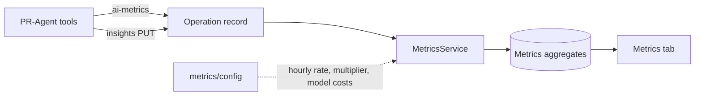

# Metrics

Part of the [Dashboard API](README.md) reference.

Aggregates **AI spend** and **developer time saved** from operation telemetry into summary, per-operation, and per-repository views. Powers the dashboard **Metrics** tab (ROI, net savings, model cost breakdowns). JWT required.

---

## Data flow



1. Each describe/review/improve operation posts token usage and `estimated_dev_hours_saved` (`POST /api/operations/{id}/ai-metrics` or multi-model variant).
2. Structured breakdown posts separately (`PUT /api/operations/{id}/insights`: `dev_time_analysis`, category hours).
3. `MetricsService` recalculates aggregates on operation updates (also via `POST /api/metrics/recalculate`).
4. UI applies config: `developer_hourly_rate`, `hours_multiplier`, per-model `model_costs`.

**Net savings (conceptual):**

```
dev_value = estimated_dev_hours × developer_hourly_rate × hours_multiplier
net_savings = dev_value − total_token_cost
roi_pct = (net_savings / total_token_cost) × 100   when cost > 0
```

---

## Endpoints

| Method | Path | Notes |
|--------|------|-------|
| GET | `/api/metrics/summary` | Totals: token cost, dev hours, net savings, operation counts |
| GET/POST | `/api/metrics/config` | `developer_hourly_rate`, `hours_multiplier`, `model_costs` |
| POST | `/api/metrics/recalculate` | Rebuild aggregates from all operations |
| GET | `/api/metrics/operations` | Per-operation-type rollups |
| GET | `/api/metrics/repositories` | Per-repo rollups |

WebSocket: `metrics_update` when aggregates refresh after a job completes.

---

## Configuration (`POST /api/metrics/config`)

Typical body fields:

| Field | Role |
|-------|------|
| `developer_hourly_rate` | USD (or org currency) per developer hour for value calc |
| `hours_multiplier` | Scales AI hour estimates (e.g. `0.5` conservative, `2.0` optimistic) |
| `model_costs` | Map of model id → `{ input_per_1k, output_per_1k }` for token cost |

Defaults: rate `75`, multiplier `1.0`, empty model cost map (falls back to built-in estimates where defined).

---

## Related

- Operator guide: [Reading metrics and ROI](../../how-to/reading-metrics-and-roi.md)
- Operation ingest: [Jobs & Operations → ai-metrics / insights](jobs-and-operations.md)
- PR-Agent estimation: [Developer time estimation](../internals/code-context-and-estimation.md#developer-time-estimation)
- Architecture: [Telemetry data model](../azure-architecture/README.md#telemetry-data-model)
