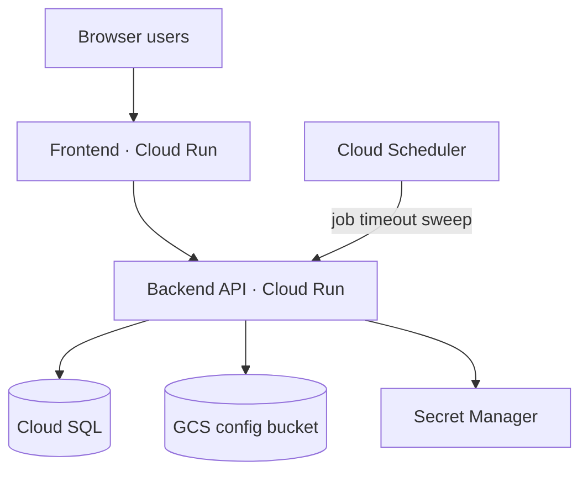
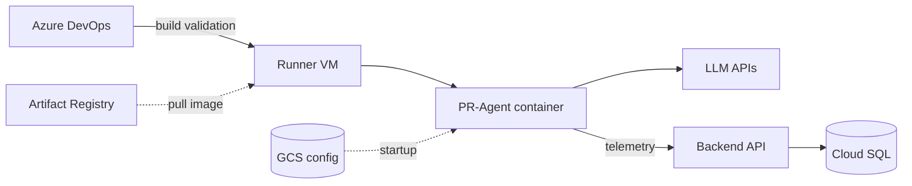

# Topology and GCP services

## Deployment topology

Two views: the **dashboard stack** on GCP, and the **PR execution path** on a self-hosted runner.

### Dashboard stack

The frontend talks to the backend over REST and WebSocket. The backend:

- Persists jobs and logs in Cloud SQL
- Reads/writes shared PR-Agent config in GCS
- Pulls secrets from Secret Manager

Cloud Scheduler POSTs to `/api/cron/run-job-timeout` on a fixed interval.

### PR execution path

PR pipelines run on a **GCE runner VM**, not on Cloud Run. The VM pulls the PR-Agent image from Artifact Registry, loads config from GCS at container startup, calls LLM APIs, and posts jobs/logs back to the dashboard backend.

## GCP services used

| Service | Role |
|---------|------|
| **Cloud Run** | Dashboard frontend and backend (separate services) |
| **Cloud SQL (PostgreSQL 15)** | Jobs, logs, repositories, users; backend connects via private IP + VPC connector |
| **GCS** | Shared PR-Agent config under `{bucket}/{prefix}/` |
| **Secret Manager** | `{prefix}-database-url`, `{prefix}-api-key`, `{prefix}-cron-secret` |
| **Artifact Registry** | Docker images for `backend`, `frontend`, and `pr-agent` |
| **VPC + Serverless VPC Access connector** | Backend → Cloud SQL; runner subnet for GCE |
| **Compute Engine** | Self-hosted Azure DevOps runner VMs (provisioned on demand from the dashboard) |
| **Cloud Scheduler** | POSTs to `/api/cron/run-job-timeout` (default every 10 min) |
| **Cloud Build** | CI/CD image builds; triggers from `setup-cicd-gcp.sh` (not Terraform) |
| **IAM** | Default compute SA: Secret Manager, GCS, `compute.instanceAdmin.v1` |
