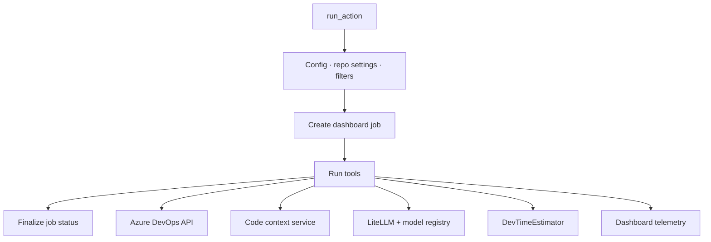

# PR-Agent internals

How PR-Agent runs on the **Azure DevOps pipeline** path: build validation on a self-hosted agent, Docker container, and `azuredevops_pipeline_runner`.

## Pages in this section

| Page | Topics |
|------|--------|
| [Code context and time estimation](code-context-and-estimation.md) | C# context service, dev-time ROI pass |
| [Config, AI, and filters](config-ai-and-filters.md) | Config loading, LiteLLM, PR filters, best practices |

## Entry point

**File:** `pr_agent/servers/azuredevops_pipeline_runner.py`

The pipeline runner imports `PRAgent` but **does not call it**: tools are instantiated directly.

## Component diagram

## `run_action()` step-by-step

1. Read ADO env; resolve PR repo/project from `SYSTEM_PULLREQUEST_SOURCEREPOSITORYURI`
2. Override `DASHBOARD.URL` / `DASHBOARD.API_KEY` from pipeline env
3. `setup_dashboard_integration()`
4. Validate required vars; return silently if missing
5. Apply `OPENAI.KEY`, PAT, org; force `CONFIG.GIT_PROVIDER=azure`
6. Build `pr_url`
7. **`apply_repo_settings(pr_url)`**: fetch `.pr_agent.toml`
8. Re-assert PAT/org/provider
9. Skip PRs with dashboard auto-PR marker in description
10. Resolve `AUTO_*` flags (`None` = enabled)
11. **`check_pr_filters()`** per command
12. If all filtered → skipped job/ops; return
13. **`job_context`** → create dashboard job
14. Run tools sequentially; each creates **`operation_context`**
15. Finalize job status; cleanup

## Git provider: AzureDevopsProvider

**File:** `pr_agent/git_providers/azuredevops_provider.py`

| Method | Role |
|--------|------|
| `get_diff_files()` | Patches for AI prompts |
| `get_pr_file_content(path, branch)` | File content; branch name bare |
| `get_repo_settings()` | `.pr_agent.toml` via `fetch_repo_file_content()` |
| `publish_comment()` | Review threads |
| `get_pr_branch()` / `get_pr_target_branch()` | Branch resolution |

Auth: pipeline `AZURE_DEVOPS_PAT`.

## Tools

| Tool | Class | Output |
|------|-------|--------|
| Describe | `PRDescription` | PR description |
| Review | `PRReviewer` | Review comment |
| Improve | `PRCodeSuggestions` | Suggestions |

Each tool opens `operation_context`, loads prompts, calls `LiteLLMAIHandler.chat_completion`, publishes via the provider, and records AI metrics.

## Dashboard telemetry

| Module | Role |
|--------|------|
| `log/job_context.py` | Job lifecycle and `operation_context` per tool |
| `log/dashboard_client.py` | HTTP to dashboard API |
| `pr_agent/log/dashboard_sink.py` | Loguru → `/logs/*` |

Pipeline jobs report `source="azuredevops_pipeline"`.

