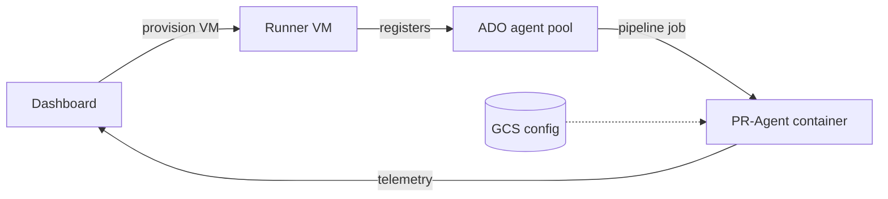

# Self-Hosted Runners

GCE VMs register as Azure DevOps self-hosted agents and run PR-Agent inside Docker.

---

## Architecture



Cloud Run hosts the **dashboard only**. PR-Agent executes on the VM inside Docker.

---

## Provisioning

Three ways to get an agent:

- **Dashboard (recommended)**: Action Runners → **Provision Runner VM**
- **Terraform legacy**: `enable_runner_vm = true` (default **false**)
- **BYO agent**: manual install; skip provisioning

API endpoints:

```
POST /api/action-runner-connections/{id}/provision
GET  /api/action-runner-connections/{id}/provision-status
```

Backend: `dashboard/backend/services/gcp_runner_service.py`  
Startup template sync: `terraform/gcp/runner-startup.sh.tpl` (Terraform template has fewer env vars than the dashboard script)

---

## Bootstrap behavior

### Self-destruct on failure

The startup script sets `trap ERR` and a **15-minute watchdog**. On bootstrap failure or timeout, the VM deletes itself via the GCE API. If provisioning disappears, check the serial console.

### Docker mode vs clone mode

- **`GCP_RUNNER_PR_AGENT_IMAGE` set**: pull image, smoke test, **skip** git clone
- **Image empty**: clone to `/opt/pr-agent`, `pip install -r requirements.txt`

GCP production deploys always set the image, so you get **Docker mode**.

### Startup steps (dashboard script)

1. Install Docker CE, Python 3, git, curl
2. Write `/opt/pr-agent-runner/env` (see below)
3. Docker mode: `docker pull`, optional login to `docker.pkg.dev` via metadata token
4. Clone mode: clone repo, pip install
5. Optional: download/configure/register Azure DevOps agent (`ado_org_url`, `ado_pat`, `ado_pool`)
6. Install agent as systemd service

Serial console milestones are parsed by `get_startup_progress()` for UI percent complete.

---

## Env file (`/opt/pr-agent-runner/env`)

Dashboard provisioning writes:

```bash
export DASHBOARD_URL="https://..."
export DASHBOARD_API_KEY="..."
export PR_AGENT_CONFIG_GCS_BUCKET="..."
export PR_AGENT_CONFIG_GCS_PREFIX="pr-agent-config/"
export GCP_RUNNER_PR_AGENT_IMAGE="us-central1-docker.pkg.dev/.../pr-agent:tag"
export AZURE_DEVOPS_PAT="..."   # when PAT provided at provision time
```

The pipeline step runs `source /opt/pr-agent-runner/env 2>/dev/null || true`. Pipeline variables **override** VM env values.

The Terraform legacy template omits `AZURE_DEVOPS_PAT` and `GCP_RUNNER_PR_AGENT_IMAGE` from the env file: prefer dashboard provisioning for ADO.

---

## Pipeline execution (GCP default)

```bash
# Generated by dashboard/backend/services/azure_pipeline_config_service.py
source /opt/pr-agent-runner/env
docker pull $IMAGE
docker run --rm --network=host --entrypoint python3 \
  -e BUILD_REASON -e SYSTEM_PULLREQUEST_* ... \
  -e AZURE_DEVOPS_PAT -e OPENAI_KEY -e ANTHROPIC_KEY \
  -e DASHBOARD_URL -e DASHBOARD_API_KEY \
  -e PR_AGENT_CONFIG_GCS_BUCKET -e PR_AGENT_CONFIG_GCS_PREFIX \
  $IMAGE -m pr_agent.servers.azuredevops_pipeline_runner
```

Reference: `azure-pipelines-pr-agent-cloud.yml`

### Alternate: Python from clone

When no Docker image is configured:

```bash
source /opt/pr-agent-runner/env
python3 -m pr_agent.servers.azuredevops_pipeline_runner
```

---

## Backend requirements

| IAM / config | Purpose |
|--------------|---------|
| `roles/compute.instanceAdmin.v1` | Create/delete VMs |
| GCS access on backend SA | Config + startup |
| `GCP_RUNNER_PROJECT_ID` | Enable provisioning API |
| `GCP_RUNNER_PR_AGENT_IMAGE` | Docker mode + pipeline template selection |

---

## Health monitoring

- **Agent online**: ADO → Organization Settings → Agent pools
- **VM exists**: GCP Console → Compute Engine
- **Bootstrap logs**: VM serial console
- **Dashboard**: Repository **Status** tab; Action Runners panel

Pipelines queued with no agent → check the pool for **offline** agents first.

---

## Deprovisioning

```
DELETE /api/action-runner-connections/{id}
POST   /api/action-runner-connections/{id}/deprovision
```

Deletes the GCE instance and unlinks repositories (repos remain in the dashboard). Verify the ADO agent is removed from the pool manually if deregistration was incomplete.

---

## Image updates

Pushing a new PR-Agent image (`cloudbuild-pr-agent.yaml`) updates `GCP_RUNNER_PR_AGENT_IMAGE` on the backend. **Existing VMs do not auto-pull**: re-provision the VM or SSH and `docker pull` manually.

---

## Troubleshooting

| Symptom | Action |
|---------|--------|
| VM gone after provision | Serial console: likely self-destruct on bootstrap error |
| `No PR-Agent image found` in pipeline | Set `PR_AGENT_IMAGE` or re-provision with image |
| Invalid image name (uppercase) | Image refs must be lowercase |
| Agent offline | Restart VM; check agent systemd service on VM |
| Registry auth failed | VM SA needs Artifact Registry read; script uses metadata token |

> **[SCREENSHOT PLACEHOLDER]**
> **Capture:** GCP serial console showing docker pull success and agent service start, OR dashboard provision-status at 100%.
> **Explain:** Match serial output lines to provisioning milestones in UI.

---

