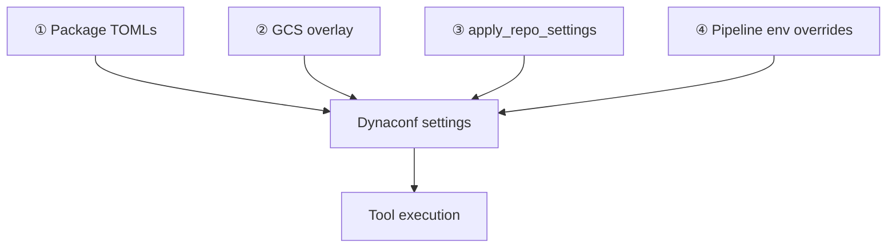

# TOML Configuration System

PR-Agent reads TOML from the package, a GCS overlay (or local path in dev), per-repository Azure DevOps files, and pipeline-time overrides.

---

## File map

| Local / package | GCS object | Contents |
|-----------------|------------|----------|
| `configuration.toml` | `configuration.toml` | Models, tools, filters, `[config]` |
| `.secrets.toml` | `secrets.toml` | API keys, ADO org/pat |
| `ignore.toml` | `ignore.toml` | Global ignore patterns |
| `csharp_code_context.config.toml` | same | Context service (non-secret) |
| `csharp_code_context.secrets.toml` | same | Context credentials |
| `*_prompts.toml` (many) | **Not in GCS overlay** | AI prompts (package only) |
| `language_extensions.toml` | **Not in GCS overlay** | Language map (package only) |
| `.pr_agent.toml` | *(in ADO repo)* | Per-repo overrides |
| `best_practices.md` | *(in ADO repo)* | Markdown standards |

Design notes: [docs/CONFIG_STORAGE_DESIGN.md](../../CONFIG_STORAGE_DESIGN.md)

---

## GCS overlay files (exactly 5)

From `config_loader._OVERLAY_FILENAMES`:

1. `configuration.toml`
2. `ignore.toml`
3. `.secrets.toml` → stored as `secrets.toml`
4. `csharp_code_context.config.toml`
5. `csharp_code_context.secrets.toml`

Prompt files and `language_extensions.toml` come from the **package only**, unless you point `PR_AGENT_CONFIG_PATH` at a local dir with custom copies.

---

## Merge order



> **`pyproject.toml`:** Optional import-time merge for local CLI when cwd is inside a git repo. Not used on standard Azure Docker pipeline runs. Production config: GCS overlay + `.pr_agent.toml`.

When you edit config in the dashboard, `ConfigService.update_config()` deep-merges into GCS files. Unlisted keys under `[config]` are preserved.

---

## `[config]` highlights

```toml
[config]
model = "anthropic/claude-sonnet-4-6-20260205"
fallback_models = ["gpt-5.3-codex-spark"]
temperature = 0.2
reasoning_effort = "medium"
max_model_tokens = 32000

use_repo_settings_file = true
use_wiki_settings_file = true
use_global_settings_file = true
repo_settings_branch = ""   # empty = auto branch detection

git_provider = "github"   # forced to "azure" in ADO pipeline runner
publish_output = true
ai_timeout = 120
verbosity_level = 0
```

Full reference: `pr_agent/settings/configuration.toml`: override only what you need.

---

## Secrets structure

```toml
[openai]
key = "sk-..."

[anthropic]
key = "sk-ant-..."

[google_ai_studio]
gemini_api_key = "..."

[azure_devops]
org = "https://dev.azure.com/{org}/"
pat = "..."   # Overridden by pipeline AZURE_DEVOPS_PAT at runtime

[dashboard]
api_key = "..."
```

The dashboard writes native sections (not a flat `api_keys` bridge) via `dashboard/backend/services/config_service.py`.

---

## Azure-specific sections

### Per-repo pipeline behavior

```toml
[azure_devops_config]
auto_describe = true
auto_review = true
auto_improve = false
enable_output = true
```

### Tool overrides

```toml
[pr_reviewer]
num_max_findings = 15
extra_instructions = "..."

[pr_filters]
max_lines_changed = 1000
skip_if_description_exists = true
```

### Code context service

Non-secrets live in `csharp_code_context.config.toml`; credentials in `csharp_code_context.secrets.toml` (dashboard migrates on save).

```toml
[csharp_code_context_service]
enabled = true
url = "https://context.example.com"
timeout = 180
default_depth = 1
default_mode = "Minified"
```

Secrets file: `username`, `password`. Pipeline may override via `CSHARP_CODE_CONTEXT_SERVICE__*` env vars.

### Developer time estimation

Prompts ship in package `pr_dev_time_estimation_prompts.toml`. Optional runtime override:

```toml
[pr_dev_time_estimation]
model = "anthropic/claude-sonnet-4-6-20260205"  # optional; estimation LLM call
```

Estimation output is stored on operations (`estimated_dev_hours_saved`, insights JSON) and aggregated by dashboard metrics config, not PR-Agent TOML.

---

## Branch resolution for repo files

`resolve_repo_file_branches()` in `pr_agent/algo/utils.py` tries branches in order:

1. `[config].repo_settings_branch` (global: must live in deployment config, not in the repo file you're loading)
2. Explicit extra branch param
3. PR source branch
4. PR target branch
5. Repository default branch (ADO API)
6. `main`, `master`, `develop`

Applies to `.pr_agent.toml` and `best_practices.md`.

---

## Dashboard config service

- **`get_config()`**: load, merge, mask secrets as `***`
- **`update_config()`**: rotating backup (max 10) → distribute to files → deep merge → GCS put
- **Bulk upload**: ZIP of TOML files replaces GCS objects with backup

`csharp_code_context_service` is split: non-secrets go to the context config file; username/password go to the context secrets file. After save, the main `configuration.toml` never retains a `csharp_code_context_service` section (values migrate to the dedicated files).

---

## Propagation timeline

| Change | Effective |
|--------|-----------|
| AI Config save → GCS | Next PR-Agent process start (new pipeline run) |
| `.pr_agent.toml` merged in ADO | Same run, after `apply_repo_settings` |
| Pipeline variable sync | Next pipeline run |
| Dashboard wizard auto-* flags | **Not** pipeline runtime: use TOML or pipeline `AUTO_*` vars |

---

